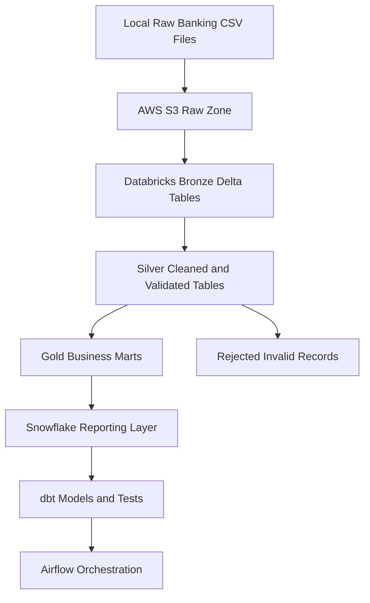

```mermaid
flowchart TD
    A[Local Raw Banking CSV Files] --> B[AWS S3 Raw Zone]
    B --> C[Databricks Bronze Delta Tables]
    C --> D[Silver Cleaned and Validated Tables]
    D --> E[Gold Business Marts]
    E --> F[Snowflake Reporting Layer]
    F --> G[dbt Models and Tests]
    G --> H[Airflow Orchestration]
    D --> R[Rejected Invalid Records]
```
